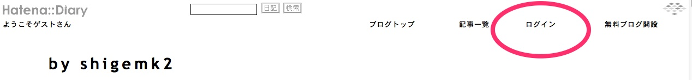
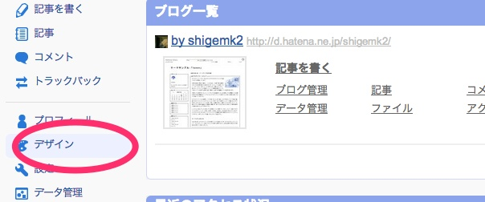

hate-da-deploy
===============

はてなダイアリーの自動デプロイツール。

「管理ページ→デザイン→詳細」でCSSやヘッダー、フッターを直接弄ることがあるのだけれど、
バージョン管理とかもされないし、毎回ブラウザで操作するのが面倒です。

しかし、はてなダイアリーのCSSやヘッダーを直接弄るAPIは用意されていないので、
ローカルでファイルを弄って、コマンド1つでCSSやヘッダーをwatirで反映させるようにしました。

[watir公式サイト](http://watir.com/)
[公式GitHub](https://github.com/watir/watir)

自動かどうかは微妙ですが。

### 導入

1 hatena.yaml.sampleを参考に、hatena.yamlに必要な情報を書く

例
```yaml
user_id ユーザー名
password パスワード
top_url https://d.hatena.ne.jp/shigemk2
login_url: https://www.hatena.ne.jp/login?backurl=http%3A%2F%2Fd.hatena.ne.jp%2Fshigemk2%2F&add_timestamp=1
detail_url: http://d.hatena.ne.jp/shigemk2/designdetail
```

## リンクの取り方

○のついているところで右クリック→「リンクアドレスをコピー」

ログインページ


デザイン編集ページ(管理ページから)



2 ヘッダーのHTMLをhatena-header.htmlに、フッターのHTMLをhatena-footer.htmlに、CSSをhatena.cssに書き、直下のディレクトリに配置する

必要なファイルを用意したあとに、以下を実行する


```zsh
bundle install
ruby hatena.rb
```

### 動作環境

当方の環境は

MacOSX 10.8.5
ruby ruby 1.9.3p392 (2013-02-22 revision 39386) [x86_64-darwin12.4.0]

です。その他の環境では試していません。

[](https://gemnasium.com/shigemk2/hatena-diary)

